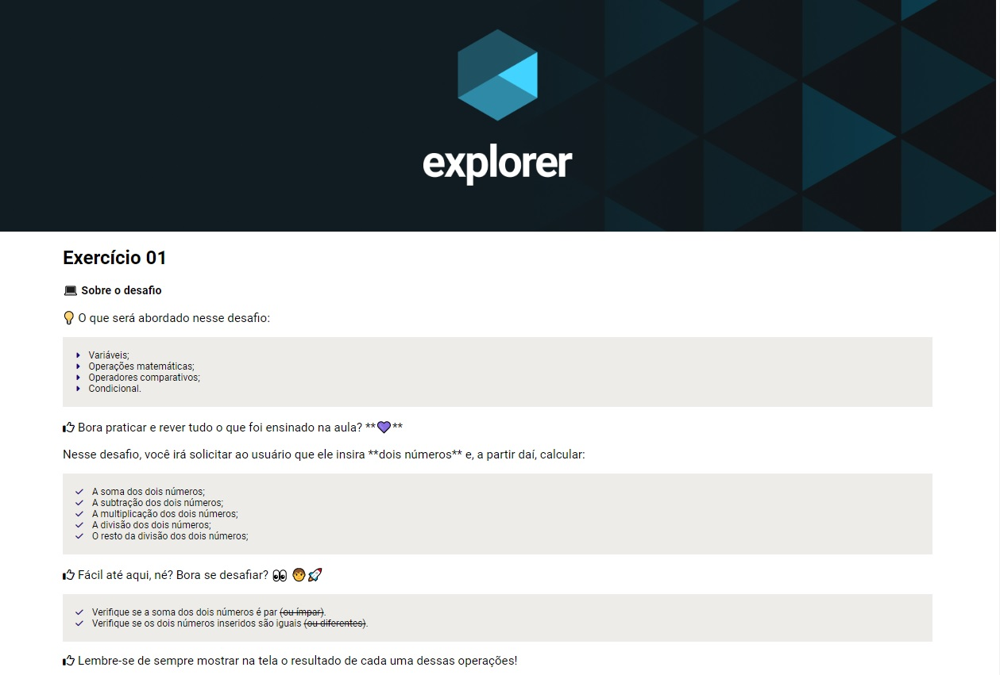

# Desafio do nível 04 - Exercicio 01 - Java Script

> Trilha Explorer 

> Projeto feito para cumprir desafio do nível 04 - <b>Exercicio 01 - Java Script</b> construído no curso Explorer da Rocketseat :rocket:. 

## :hammer_and_wrench: Tecnologias

- HTML
- CSS
- Javascript
- Git e Github

## :nut_and_bolt: Principais pontos abordados

- Variáveis;
- Operações matemáticas;
- Operadores comparativos;
- Condicional.

## :dart:  Desafio Javascript

Nesse desafio, você irá solicitar ao usuário que ele insira **dois números** e, a partir daí, calcular:

- A soma dos dois números;
- A subtração dos dois números;
- A multiplicação dos dois números;
- A divisão dos dois números;
- O resto da divisão dos dois números;

> Fácil até aqui, né? Bora se desafiar? 

:heavy_check_mark: Verifique se a soma dos dois números é par (ou ímpar).

:heavy_check_mark: Verifique se os dois números inseridos são iguais (ou diferentes).

## :mailbox_closed: Contatos

> Email - rosendc30@gmail.com

> Linkedin - https://www.linkedin.com/in/francisco-rosendo-a05623241/
